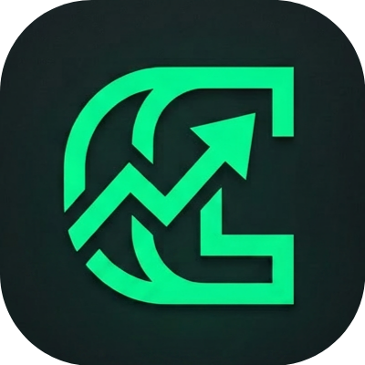

<p align="center">
  
</p>

<h1 align="center">Expenzo</h1>

<p align="center">
  <strong>Smart expense tracking that works offline.</strong><br>
  Auto-parse bank SMS, set budgets, track recurring bills — your finances, always in hand.
</p>

---

## 🚀 Key Features

### 📊 Smart Dashboard
Stay on top of your financial health with an at-a-glance summary of income, expenses, and current balance. Compare performance with percentage changes vs. previous periods and view your category breakdown instantly.

### 💰 Expense & Income Tracking
Log transactions manually or let Expenzo handle it. Each record tracks its origin—manual entry, SMS, email, or recurring—ensuring a complete audit trail of your spending.

### 📱 SMS Auto-Parser
Never miss a transaction. Expenzo scans your device's SMS inbox for bank messages and parses them in the background. A daily background scan keeps your records up to date and notifies you when new expenses are found.

### 📝 Message Templates
Create custom parsing templates for your specific bank or mobile wallet. Use the visual template builder to simply paste a sample message and tap the amount to extract—Expenzo handles the rest.

### 🔍 Powerful Parsing Rules
Under the hood, global regex-based rules extract amounts, dates, and descriptions with high precision. Rules use confidence scoring to ensure your data is accurate before it hits your ledger.

### 🔄 Recurring Transactions
Set it and forget it. Schedule daily, weekly, monthly, or yearly repeats for bills and salary. Expenzo handles month-end edge cases and can automatically create records for you when they're due.

### 📈 Reports & Insights
Visualize your spending with interactive charts. See a category breakdown via donut charts or track your spending trend over time with line graphs. Discover insights like your highest spending day and average daily spend.

### 💵 Budget Management
Set spending limits per category or for your entire month. Enable **rollover** to carry forward unspent funds, and receive push notifications when you're approaching or exceeding your limit.

### 🔎 Advanced Search
Find any transaction in seconds with full-text search. Filter by category, date range, or amount to drill down into your history.

### 🔔 Notification Center
A dedicated feed for everything that matters: budget alerts, recurring bill reminders, scan results, and sync status updates.

### ⚙️ Personalized Settings
- **Multi-Currency:** Support for BDT, INR, USD, EUR, GBP, JPY, and custom Unicode symbols.
- **Theming:** Full support for Light, Dark, and System modes.
- **Privacy:** Secure account management and data deletion flows.

### ☁️ Offline-First Cloud Sync
Expenzo is built to work anywhere. Core functionality requires no internet; sign-in is only needed for cloud backup. Data syncs automatically in the background when you're back online, with smart conflict resolution to keep your data safe.

### 🔐 Secure Authentication
Secure sign-in via Google or Email. Your data is yours—Expenzo provides easy tools to manage or delete your cloud presence at any time.

---

## 🧑‍💻 Developer Setup

After cloning, run:

```bash
./scripts/setup-hooks.sh
```

This configures Git to use the repo-local hooks in `.githooks/`.

---

## 🛠 Built With

| Category | Technology |
|---|---|
| **Framework** | Flutter |
| **State Management** | BLoC (Business Logic Component) |
| **Local Database** | Drift (SQLite) |
| **Auth & Cloud** | Firebase Auth |
| **Networking** | Dio (REST API) |
| **Visuals** | fl_chart |

---

<p align="center">
  © 2026 Expenzo. All rights reserved.
</p>
